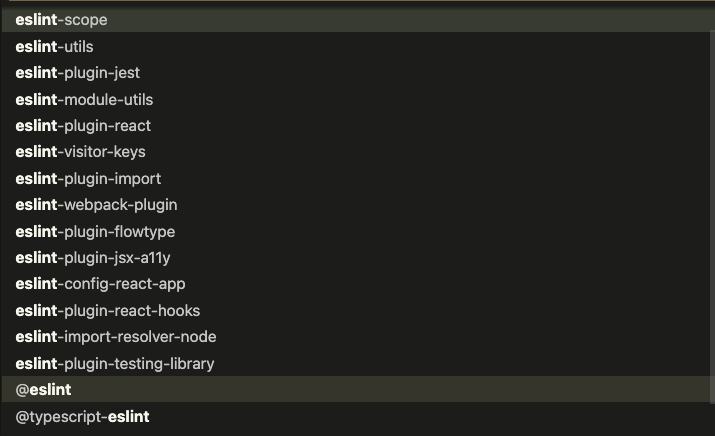

# Reactのプロジェクト構成について

##　この章の目標

- Reactのプロジェクトの始め方について学ぶ
- package.jsonの役割について学ぶ
- コードをフォーマットしながら開発できるようになる
- HTMLからjsを読み込みReactを利用する仕組みについて理解する

## Reactの新規プロジェクトの作成

Reactには初期プロジェクトをテンプレートから作成してセットアップしてくれるライブラリが存在しています。
また、フレームワークに組み込まれ、フレームワークが初期プロジェクトを構成してくれる仕組みを提供してくれていることもあります。
以下２つのフレームワークを紹介します。

- [Next.js](https://nextjs.org/): Reactで様々なユースケースでWEBアプリケーションをホスティングする設定を柔軟に変更することができる汎用的なフレームワークです。元はMiddlewareを利用してSSRによってサイトをホスティングすることがメインのフレームワークでしたが、現在では、ExpressなどのMiddlewareとして組み込むことでバックエンドのAPIを組み合わせたり、export機能を使って静的サイトを出力できます(Nuxt.jsのように完全なSPAではなく、それぞれのpageに対してhtmlとjsが独立したSPAとして出力されるので、ホスティング時に適切なルーティングが必要になることに注意が必要です)。また、build前に必要なデータをDBなどに問い合わせデータを埋め込んでから静的ページをビルドするSSG(Static Site Generation)に加え、サーバへのエンドポイントへのリクエストをトリガーにして静的ページを生成し、2回目以降のリクエストはその静的ページの配信に切り替える[ISR](Incremental Static Regeneration)という仕組みに対応しています。ISRは、ブログやユーザー投稿ページをDBリソースを保持することなく生成することができる事や、コンテンツ配信のパフォーマンスの高いサイトコンテンツを拡充しやすくSEO対策に有利に働くというメリットがあります。


- [gatsby](https://www.gatsbyjs.com/): ReactでSSGを利用した静的ホスティングサイトを作るためのフレームワークです。gatsbyの内部configの取得にGraph QLを利用しておりbuild前にページデータfetchを行いページに埋め込むことでHTMLとjsファイルを生成して静的サイトを作ることが出来ます。gatsybyのpluginを利用してGraph QLに紐づくデータを拡張することができ、Graph QLのエコシステムの中で開発ができることが特徴です。[Mochi株式会社のテックブログ](https://blog.mochicorp.com/)もgatsbyを用いて作成されています。

これらのフレームワークは初期設定済みのプロジェクトをすぐに生成して作り始めることができます。実際のサービスを作成する場合ではフレームワークを利用するケースが多いと思いますが、今回はまずReactの基本を抑えていくためにcreate-react-appを利用したシンプルなReactのアプリケーションのテンプレートを使っていきます。

## create-react-app

- [create-react-app](https://www.gatsbyjs.com/): 様々なReactのプロジェクト設定のテンプレートからReactのプロジェクトを生成できるコードGeneratorです。また、内部でjestやESLintやtypescript、webpackによるビルドなど、Reactを使う上で複雑な設定をラップしてくれているため入門者でもすぐにReactの開発を始めることができます。

**webpackはモジュールバンドラーと呼ばれるJavascriptコードの難読化や利用されていないコードの排除や重複コードの最適化を行うといったビルド方法を柔軟に定義して実行できるツールです**


以下のコマンドでTypescriptのテンプレートを利用して、Reactのプロジェクトを作成してみましょう。

```shell
npx create-react-app lesson-chat --template typescript
```

npxは現在使用しているNode.jsのマシン内のグローバル環境あるいは、local環境にインストールしてあるライブラリ上のコマンドを検索し有ればそのまま利用し、なければ一時的にメモリにインストールしてライブラリを実行するコマンドです。create-react-appは実行する時のみ必要であり、利用した時の最新バージョンを使えることにメリットがあるのでnpx経由で実行することをお勧めします。lesson-chatプロジェクトが生成されたら、中身をエディタでみていきましょう。

### package.json

まず、package.jsonというファイルをみてください。2020/04/13の時点では以下のようなファイルの中身になっていると思います。

```json:package.json
{
  "name": "lesson-chat",
  "version": "0.1.0",
  "private": true,
  "dependencies": {
    "@testing-library/jest-dom": "^5.11.4",
    "@testing-library/react": "^11.1.0",
    "@testing-library/user-event": "^12.1.10",
    "@types/jest": "^26.0.15",
    "@types/node": "^12.0.0",
    "@types/react": "^17.0.0",
    "@types/react-dom": "^17.0.0",
    "react": "^17.0.2",
    "react-dom": "^17.0.2",
    "react-scripts": "4.0.3",
    "typescript": "^4.1.2",
    "web-vitals": "^1.0.1"
  },
  "scripts": {
    "start": "react-scripts start",
    "build": "react-scripts build",
    "test": "react-scripts test",
    "eject": "react-scripts eject"
  },
  "eslintConfig": {
    "extends": [
      "react-app",
      "react-app/jest"
    ]
  },
  "ブラウザslist": {
    "production": [
      ">0.2%",
      "not dead",
      "not op_mini all"
    ],
    "development": [
      "last 1 chrome version",
      "last 1 firefox version",
      "last 1 safari version"
    ]
  }
}
```
ここに列挙されているものに関してpackage.jsonの標準的なプロパティについて説明します。

- name: projectあるいはpackageの名前を表記します。ライブラリとして公開した際のインストール名としても使われます。
- version: packageのバージョンです。ライブラリを公開した時のバージョニングやプロジェクトのバージョニングに使えます。
- private: trueにしておくと、npm publishコマンドを拒絶することができるので誤ってパッケージを公開してしまう事故を防げます。
- scripts: 好きな名前をつけたScript名に対してshellコマンドを登録し`npm run $Script名`yarnをinstallしている場合は`yarn $Script名`でコマンドを実行することができます。開発でよく使うコマンドやCI上で実行させたいコマンドを登録します。通常のshellでは、node_modules/.binにあるパスのコマンドを利用したい場合は、`npx $コマンド名`か、`$(npm bin)/$コマンド名`を使用してコマンドを参照する必要がありますが、scripts内のshellコマンドでは、./node_modules/.binを参照パスに入れて実行するので、インストールされているコマンドをそのまま実行する事ができます。cliツールを利用する場合でもglobalにインストールするよりもlocalにインストールして使う方が都合がいい場合はlocalにインストールすることを推奨します。例ではlocal installしてあるreact-scriptsを利用しています。
- dependencies: プロジェクトで使用するライブラリとそのバージョンを記述します。npm install（あるいはyarn add）でライブラリを追加した時に自動で追記されます。
- devDependencies: プロジェクトの開発時にのみ使用するライブラリとそのバージョンを記述します。npm i --productionを使用するとinstallを省くことができるので、本番で利用しないパッケージのインストールを省略できます。npm install --save-dev（あるいはyarn add --dev）でライブラリを追加した時に自動で追記されます。
- peerDependencies: ライブラリをリリースしたい場合にdevDependenciesと組み合わせて利用します。開発環境ではdevDependenciesのバージョンで開発しつつ、利用者側では利用するライブラリのバージョンのぶれを許容したい場合に利用します。例としてはReactのライブラリは16.0.0で開発しているけど、特にそれ以降のバージョンのライブラリであれば同じように使えることをサポートしたい場合などにpeerDependenciesにreact: ">=16.0.0"と書くと、利用者側はこれを自分のprojectのdependenciesに含めることを強制できます。dependenciesに書いてしまった場合は指定のバージョンの依存ライブラリがインストールされ、利用先のプロジェクトとライブラリのバージョンが食い違っていた場合、 それぞれ別のバージョンでコードが動きますがこれが意図通りの挙動であるか確かめる必要があります。

初期状態のプロジェクトでは

```json:package.json
{
    //...略
    "@testing-library/jest-dom": "^5.11.4",
    "@testing-library/react": "^11.1.0",
    "@testing-library/user-event": "^12.1.10",
    "@types/jest": "^26.0.15",
    "@types/node": "^12.0.0",
    "@types/react": "^17.0.0",
    "@types/react-dom": "^17.0.0",
    "typescript": "^4.1.2",
}
```

これらのライブラリはbuildの生成物に含まれる必要がないのでdevDependenciesに移しておきましょう。


残りの

- eslintConfig
- browserslist

プロパティ関しては
[eslint](https://eslint.org/)
[browserslist](https://github.com/browserslist/browserslist)
をインストールした時に使われる拡張プロパティでpackage.jsonに備わっている標準のプロパティではありません。このように、package.jsonが使っていないプロパティに関してはライブラリ側で自由に使っても問題ありません。しかし、ライブラリを作る時にはこれらのプロパティの名前が他のライブラリと被ることがないように注意したり、外部ファイルから設定を呼び出す事もできるようにしましょう。実際、eslintConfigは.eslintrc.jsというファイルに書き移すことができたりと、外部の設定ファイルをライブラリがサポートしている場合がほとんどです。個人的には、使われている設定ファイルを一覧できた方が設定を把握しやすいため、ほとんどの場合で設定ファイルを切り出すことをお勧めしています。（huskyなど、package.jsonの内容に依存した設定が必要なライブラリなどは例外として扱って良いと思います。）

ここでは.eslintrc.jsファイルを作成しeslinConfigの内容を、.browserslistrcを作成しbrowserslistの内容を書き移しておきましょう。

```js:.eslintrc.js
modules.exports = {
    "extends": [
      "react-app",
      "react-app/jest"
    ]
}
```

```text:.browserslistrc
[production]
>0.2%
not dead
not op_mini all

[development]
last 1 chrome version
last 1 firefox version
last 1 safari version
```

### ESLint+Prettierを導入する

- ESLint: Node.js性のNode.js、Tyescriptなどのコードのルールを定めルールに違反しているコードを検出したり矯正を行うツールです。プラグインによって機能拡張ができて、typescriptで利用するにはプラグインを導入する必要があります。類似ツールにTypescriptで使えるTSLintが有りますが拡張性の問題から現在はESLintに機能を集約する方向に進んでいて、TSLintの利用は非推奨になっています。
- Prettier: Node.js用のコードフォーマッターでコマンドを実行する事でPrettierの定めるルールにしたがってコードを整形させることができます。ESLintも独自にFormatterを持っていますがそれぞれフォーマットに適応されるルールに差分があります。Prettierのフォーマット結果がESLintのルールに違反しないように注意して設定する必要がありますが、推奨設定にしたがっていればそれほど罠にはまることはありません。

ESLintに関しては実はreact-scriptsパッケージの中にTypescriptを使うのに必要なpluginが最初からインストールされています。



なので、prettierの設定をしていきます。

```bash
yarn add -D prettier eslint-config-prettier eslint-plugin-prettier
```

を実行するとesintの設定にprettierのフォーマッターを組み込むことができます。
eslint-config-prettierはeslintとprettierが競合するルールを打ち消します、eslint-plugin-prettierはprettierの機能を拡張します。
'plugin:prettier/recommended'を指定するとeslint-plugin-prettierのルールを読み込んだ上で、eslint-config-prettierで競合ルールの無効化をしてくれます。

```js:.eslintrc.js
module.exports = {
  parser: '@typescript-eslint/parser',
  plugins: ['@typescript-eslint'],
  extends: [
    'eslint:recommended',
    'react-app',
    'react-app/jest',
    'plugin:@typescript-eslint/recommended',
    'plugin:prettier/recommended',
  ],
};
```

詳しくはこの[Qiitaの記事](https://qiita.com/ikngtty/items/4df2e13d2fa1c4c47528)と[ESLintの詳しい設定ルール](https://eslint.org/docs/user-guide/configuring/configuration-files#extending-configuration-files)も参考にしてください。

*2020/6月ごろ*よりeslint-prettierを使う事はprettierチームは非推奨にしているようです。理由はeslintが遅いからで、prettierに新たに構文チェックの機構が備わったからです。いくつかのformatルールなどでeslintをどうしても使いたい場合を除いてprettier単体で実行するかprettierでカバーできない部分だけをeslintのフォーマットを行う事を推奨しています。ただし、ReactやTypescriptのESLintルールはまだ恩恵が大きい事と、Prettierを分離するとVSCodeの設定が複雑になるのでこのチュートリアルではESLintを使用していきます。

## scriptsにlintルールを設定する

先ほど説明したpackage.jsonのscriptsの機能を使ってみましょう。以下のように`lint`コマンドと`lint:fix`コマンドを登録します。

```json:package.json
{
  "scripts": {
    "start": "react-scripts start",
    "build": "react-scripts build",
    "test": "react-scripts test",
    "eject": "react-scripts eject",
    "lint": "eslint src --ext .ts,.tsx",
    "lint:fix": "eslint --fix src --ext .ts,.tsx",
  }
}
```

登録したら、`yarn lint`を実行してみましょう。おそらく、いくつかの初期状態のコードがエラーを吐くはずです。
これを自動で直すために、`yarn lint:fix`コマンドを実行してみます。するといくつかの行で警告が出ますが、エラーはなくなったと思います。
このようにlinterを用いると、コードの整形やルールを守っているかどうかのチェックに人の手間を割く必要がなくなり、生産性をあげることができます。


## Auto Fromatterを有効にする(VSCodeを利用している場合)

プロジェクトを作成後lesson-chat/.vscode/settings.jsonに以下の記述を入れます。

```json
{
  "eslint.validate": [
    "javascript",
    "javascriptreact",
    "typescript",
    "typescriptreact",
  ],
  "editor.codeActionsOnSave": {
    "source.fixAll.eslint": true
  }
}

```

vscodeのPrettierとESLintのプラグインをinstallしてlesson-chatプロジェクトからVSコードを開くと自動でコードが整形されるようになります。

## TypescriptとReactとHTMLの関係性について

このチュートリアルではTypescript及びHTMLの知識を前提としていますが、Typescriptで書かれたReactのプログラムがどのようにHTMLに読み込まれるかを詳しく説明します。TypescriptをJavascriptに変換してHTMLから呼び出すメカニズムについて理解されている方はこのパラグラフをスキップしても構いません。

近年のブラウザベンダはW3Cという仕様の標準化を行う団体によって作られたEcmascriptというScript言語仕様に沿ってブラウザに搭載されるJavascript APIを作っています。これは各社別々にブラウザを開発していた経緯から各社のJavascriptに非互換性APIが多く実装されてしまったことにより、WEBエンジニアは各々のブラウザに対応するために複数の非互換性Javascriptの仕様を吸収するためのプログラムを書かなければいけなかったという負の歴史を踏まえ、各社でブラウザの仕様が共通になるように方針を定めることにした結果です。

これによりEcmascriptと言う言語標準仕様を満たすJavascript(ブラウザ上で動作するJavascriptと区別するために以下Ecmascriptとします)でプログラマが機能の実装を行い、そのコードをトランスパイル(狭義のコンパイルと意味は同じですがバイナリではなくscriptをscriptに変換しているので広義のコンパイルとは区別してそう呼んでいます。)して、各々ブラウザ互換のスクリプトに変換する仕組みを作ることによって、一つのコードでなるべく多くのブラウザに対応できるようになりました。

このEcmascriptをトランスパイルするために[babel](https://babeljs.io/)というトランスパイラが使われています。babelはtransformaerという構文変換プログラムをプラグインという形式で指定してつなぎ合わせる事で上位Ecmascriptを下位のEcmascript(最終的には比較的新しいブラウザ全てにおいて互換性のあるJavascriptの範囲まで)に変換することができます。この、ある一定の下位バージョンのEcmascriptまで変換に必要な設定済みのプラグインの集合をプリセットと呼びます。babelを使用した場合ES5(2009年12月制定のEcmascript仕様)より上位のEcmascriptからES5への変換を行うプリセットが継続的に開発され続けています。それ以前の仕様としてはトランスフォーマーやその他のツールを駆使する必要がありますが、実用上はES5に対応していればほぼ最新のブラウザでは問題なく動くことに加えて、現実的にはES3(1999年12月制定)までの範囲でトランスパイルできれば特殊なデバイスやソフトウェア環境を除いて十分と言えます。また、古いバージョン対応の必要も今後はなくなっていくでしょう。

**ES4は仕様がまとまらず欠番になっています**

なぜBabelの話をしたのかと言いますと、実はTypescriptはEcmascript仕様を極力満たすように作られた言語であり、Typescriptは直接ブラウザに読み込ませる事はできないのですが、実はEcmascriptのバージョンを指定してJavascriptにトランスパイルすることができます。この時、Typescriptに備わっている比較的新しいEcemaScript仕様を使わなければES3までトランスパイルも可能です。

そしてReactは通常のブラウザで動くEcmascriptの仕様とは別に**jsx**と呼ばれるJavascript上でDOMを解釈できるようなJavascriptの言語を拡張した仕様を持っています。
[Reactはjsxを利用しなくても書くことができます](https://ja.reactjs.org/docs/add-react-to-a-website.html)が、通常の開発者はjsxを使用しないメリットがほぼないので、Reactは通常jsxの仕様を前提としたフレームワークであると考えてください。
上記のリンクを読まれた方は既に気づかれているかもしれませんが、Reactはライブラリの中にjsxを解釈するための「トランスフォーマー」を持っており、リンク内の例では実際にブラウザのランタイム上で動くbabelがこのトランスフォーマーを利用して、JITトランスパイルを実行しているのです。通常この方法はユーザーへのファイル送信が大きくなる他実行時オーバーヘッドが存在するので好ましくありません。

これらを通常のブラウザで動かす際にはTypescript + Reactをあらかじめトランスパイルしておいてブラウザ上のscriptタグで読ませる事で実現します。

TypescriptにもReactのトランスフォーマーを組み込む仕組みがあり、tsxというjsxをTypescriptに拡張した言語仕様を持つことができます。これは、tsxからブラウザで利用するESバージョンを指定しても良いのですが、Typescriptでトランスパイルしたコードをさらにbabelでトランスパイルすることによって、本来babelにしか実装されていないtransformerを用いることが可能になり、ただ単にトランスパイルするだけでなく、babelを応用したエコシステム（webpackのコード圧縮やデバッグツール）にTypescriptをを組み込むことが可能になりました。

また、babel自体のtransformerにTypescriptのtransformerを組み込むという逆輸入も行われており、babelを介してTypescriptからES5へのトランスパイルが可能になり、webpackを利用するエコシステムと比べて手軽にbabelに付随するツールをTypescriptでも利用できるようになりました。（ただしwebpackなどのエコシステムと比較して解析時の制限などが入るトレードオフがあります。）

このようにTypescript + Reactのトランスパイル方法にはある程度多様性がありますが、まとめるとTypescriptを利用する場合ブラウザ上でそれらを実行させるためにはES5仕様のJavascriptまでトランスパイルをしてブラウザに読み込ませる必要があると言うことです。

このことを理解しているとどのようなフレームワーク上やランタイム上でReactを用いたとしても利用方法に困る事はないでしょう


