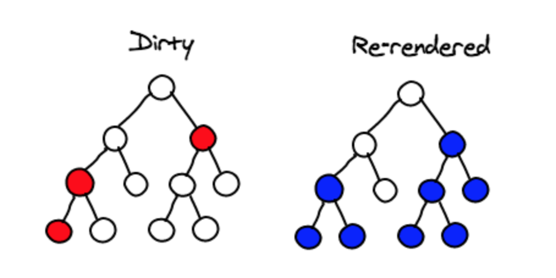
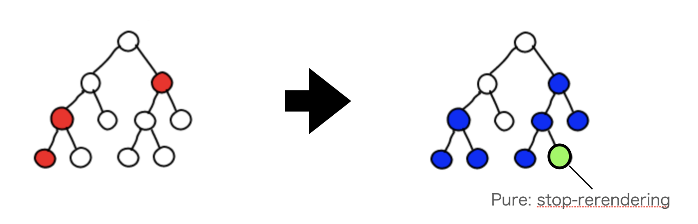
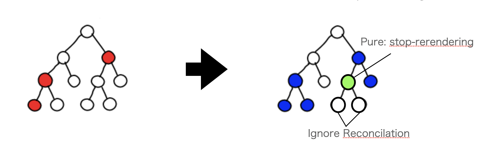

# コンポーネントを作る

## Reactアプリケーションを起動する

まず、`yarn start`を実行してみます。
この時自動でブラウザが自動で立ち上がり、アプリケーションの初期ページが表示されると思います。


次に`yarn build`を実行してみましょう。デフォルトではbuildと言うディレクトリに複数のディレクトリとファイルが生成されるはずです。

ここで`public/index.html`と生成された`build/index.html`を見比べてみましょう。新たに生成された`build/index.html`にはファイルが一行に圧縮されているのに加え、javascriptのコードが書かれたscriptタグが挿入されているのがわかるかと思います。開発用のコードは主にユーザーに提供する前に

- ユーザーのブラウザやマシンで読みとれる形式にする
- コードやファイルを圧縮する
- コードを難読化する(Script言語はソースコードが利用するユーザーに見えるので変数名や、処理順序が分かりにくいようにする。変数名を1文字にするなどの情報圧縮の副産物的な側面があるので、完全にリバースエンジニアリングが(困難だとしても)不可能でないことには注意しましょう。)
- 使われてないコードを除去する

などと言った過程を踏むようにbuildという作業を行います。buildに含まれる作業はツールによって様々で、詳しいbuildの内容を知りたい場合は利用しているフレームワークについて調べてください。

このCreate React Appで作成されたアプリケーションをユーザーに提供する場合は、このbuildディレクトリ配下のファイル全てを、インターネットを介してhttpまたはhttpsプロトコルでpublicにアクセス可能なホスティングサーバのストレージに配置し、ユーザーのブラウザやhttpクライアントでアクセスしてもらう形で提供することができます。

例えばFirebase HostingやAmazon Amplify, S3,Netlify、Vercelなどのcloudサービスを利用してホスティングすることが可能です。

## Reactのエントリポイントを確認してみる

ここでindex.tsxの中身を見てみると処理のようなコードが見つかると思います。


```tsx:index.tsx
ReactDOM.render(
  <React.StrictMode>
    <App />
  </React.StrictMode>,
  document.getElementById("root")
);
```

[React.StrictMode](https://ja.reactjs.org/docs/strict-mode.html)の詳細についてはリンク先の記事も参考にしてください。

ReactはVirtual DOM（仮想DOM）と呼ばれる仕組みによって、HTMLのDOMを内包した仮想的なDOMをJavascriptのデータ構造としてメモリに保存し、指定したタグを起点にして内包しているDOMによって書き換えます。上記の例ではrootというidがついたタグを第一引数で表されるReact Componentに書き換える処理を実行するコードになっています。この処理のようにReactのVirtual DOMが内包しているDOMでHTMLを書き換える事をレンダーあるいはレンダリングと呼びます。

この時一度レンダリングされたDOMに対してHTMLのユーザー操作により変更が加えられた時、あるいは、JavascriptからVirtual DOMが持っているパラメータに変更が加えられた時に、Virtual DOMはその差分が生じた部分を検出（Reconcilation）し、HTMLを再レンダリングします。このVirtual DOMが差分検出のために用いるデータオブジェクトをFacebookはfiberと名付け、Reconcilationを行う処理エンジンをFiberと名付け開発しています。FiberやReconcilationの仕組みを詳しく知りたい方は[こちらのリンク](https://ja.reactjs.org/docs/faq-internals.html)を参照してください。

Reactはまた、仮想DOMの中に仮想DOMを階層的に構築することが可能です。それを模しているのが以下の図です。



[引用元](https://medium.com/@coolram2104/digging-deeper-inside-the-reconciliation-algorithm-of-react-f0d428ba4ae9)

また、Reactにおいては仮想DOMとJavascriptを組み込んだ関数、あるいはClassの事をコンポーネントと呼び、上記の図ではそれぞれのノード、あるいは部分的に木構造を切り出した時にルートにあたるノードが構成する部分木に対応しています。部分木の事をコンポーネントと呼ぶ事に関して違和感を感じる人は、一つの仮想DOMを階層的に出来るということはその逆の木構造になっている仮想DOMを一つの仮想DOMにまとめることが出来るという事実を踏まえて、ノードと部分木が等価に変換可能であるという事を意識するとよいでしょう。

どの大きさの仮想DOMをコンポーネントとして扱うかはユーザーの裁量に委ねられています。しかし、ある程度巨大な仮想DOMは開発中に管理がしにくくなる他、ReactにはReconcilationが行われるコンポーネントを最小限にすることでユーザーのブラウザ上でのアプリケーションの処理速度を向上できるため、一般的には、出来るだけ細かく分割することが推奨されており、また、[ウォーターフォール](https://ja.reactjs.org/docs/concurrent-mode-suspense.html#approach-1-fetch-on-render-not-using-suspense)と呼ばれるコンポーネントの読み込み時間が直列になってしまう現象を防ぐために、出来るだけツリーのNodeを浅くするようにコンポーネントを構成するのがよいです。

後半の章で説明しますが、効率的にコンポーネントツリーを構築するためのデザイン指針として、[アトミックデザイン](https://bradfrost.com/blog/post/atomic-web-design/)というものがあり、多くの組織で採用されていますが、ルール上の定義は曖昧な部分がありReactに導入する場合には運用上の注意、トレードオフ、メリット、デメリットが存在するので、それらを理解した上で、自分達のプロジェクトで取り入れるべきか、また、どういう運用にするべきかを判断するようにしてください。

上記のAppコンポーネントはページ上の全て機能を階層的な仮想DOMに内包しており、仮想DOMの状態遷移によってユーザーの見ているページを動かすという仕組みになっています。

このように、ある１つの仮想DOMにURL遷移を含むユーザーにインタラクションする全ての機能を盛り込んで提供することが可能で、このような方法で提供されるアプリケーションをSPA(Single Page Application)と呼びます。

## Reactのコンポーネントについて

Reactのコンポーネントにはライフサイクル（作成時や除去時などのイベント処理のルール）や内部データをキャッシュしておくためのstateとpropsという特殊なパラメータを保持する仕組みがあります。そして、ReactのコンポーネントはFunction形式(Functional Component)とClass形式(Class Component)で書くことができます。

```tsx:Function.tsx
function Welcome(props) {
  return <h1>Hello, {props.name}</h1>;
}
```

```tsx:Class.tsx
class Welcome extends React.Component {
  render() {
    return <h1>Hello, {this.props.name}</h1>;
  }
}
```

これら二つの書き方の違いはFunction形式はhooksという仕組みを使って、ライフサイクルやStateを保持する仕組みを拡張して実装していくのに対し、Classの方はReact.Componentに定義されているイベントをOverwriteしたり、`this.props`、`this.state`、`this.setState`などClass定義済みのAPIを介してコンポーネントを操作します。

Classの方が古い書き方で、定義済みの関数を持つ分メモリ使用量やReconcilationの最適化を意識して実装することが求められるので、Function形式に比べて実装量が多くなったり、パフォーマンスの問題を見落とし安くなります。Functional ComponentはClass Componentに対する全ての機能に対して互換性を持っているのでライブラリの後方互換性などを目的にしない限り、Functional Component + hooksで実装する事をお勧めします。


## Reactアプリケーションの表示内容を変更する

ここから実際にテンプレート上のコードを書き換えていきます。まずはブラウザを開いたまま初期画面に書いてある通りsrc/App.tsxファイルを開いて、

```tsx
Edit src/App.tsx and save to reload.
```
という文字列を
```tsx
Hello World!
```

に書き換えてみましょう。この時、ファイルを保存したタイミングでブラウザで表示されているメッセージが変更されたかと思います。

これは、react-scriptsで起動したReact ApplicationではHMR(Hot Module Replacement)という機能をデフォルトで有効にする設定がなされているためです。HMRは開発中のマシンでホスティングしているWEBページを変更した場合ブラウザ上で表示している内容をreloadせずに変更出来る場合はjavascriptを利用して変更し、再ビルドなどが必要な場合は、自動でbuildし直してreloadして開発をしやすくしてくれる機能です。

一般的にはこれらの機能はReactに特別な機能ではなく、Reactを単体のライブラリとして使う場合にHMRが必要な場合は設定が必要ですが、最近のフレームワークではデフォルトで有効になっていることが多いです。

ここで、src/App.tsxの中身は以下のようになっていますが、

```tsx:src/App.tsx
import React from "react";
import logo from "./logo.svg";
import "./App.css";

function App() {
  return (
    <div className="App">
      <header className="App-header">
        
        <p>Hello World!</p>
        <a
          className="App-link"
          href="https://reactjs.org"
          target="_blank"
          rel="noopener noreferrer"
        >
          Learn React
        </a>
      </header>
    </div>
  );
}

export default App;
```

ここからコンポーネントを階層的に分けてみましょう。例えば以下のようにheaderのタグをWidgetというコンポーネントに切り出して階層的にしてみます。

```tsx:src/App.tsx
import React from "react";
import logo from "./logo.svg";
import "./App.css";

function Widget() {
  return (
    <header className="App-header">
      
      <p>Hello World!</p>
      <a
        className="App-link"
        href="https://reactjs.org"
        target="_blank"
        rel="noopener noreferrer"
      >
        Learn React
      </a>
    </header>
  );
}

function App() {
  return (
    <div className="App">
      <Widget />
    </div>
  );
}

export default App;
```

これで、Appコンポーネント内にWidgetコンポーネントをはめこんで階層的になりました。このようにコンポーネントを分けることで、Widgetコンポーネントはその他のコンポーネントに組み込むことができるようになります。

## Propsを理解する

上記のWidgetコンポーネントは再利用できるようにはなりましたが、表示内容を変更することができません。どのコンポーネントでWidgetコンポーネントを利用したとしてもHello World!という語句やLearn Reactという語句のメッセージが表示されます。これが困らない場合はこれで構いませんが、再利用を目的にする場合は、メッセージを設定できる方が良いと思います。ここで、登場するのがPropsです。Propsは上位のコンポーネントから下位にあたるコンポーネントに対してパラメータを渡すことができる仕組みです。コンポーネントのPropsを有効にするためには関数コンポーネントの場合は関数の第一引数を定義します。これはJSXに渡した属性名とパラメータのセットをkeyとValueに設定したDictionary形式のパラメータで渡されます。ここで、`Hello World!`と表示されている文字列をこのPropsに渡したmessage属性の値`Hello React!`を表示するように変更してみましょう。


```tsx:src/App.tsx
import React from "react";
import logo from "./logo.svg";
import "./App.css";

interface WidgetProps {
  message: string;
}

function Widget(props: WidgetProps) {
  return (
    <header className="App-header">
      
      <p>{props.message}</p>
      <a
        className="App-link"
        href="https://reactjs.org"
        target="_blank"
        rel="noopener noreferrer"
      >
        Learn React
      </a>
    </header>
  );
}

function App() {
  return (
    <div className="App">
      <Widget message="Hello React!" />
    </div>
  );
}

export default App;
```

無事メッセージが変更されたかと思います。この時、Propsで渡された値はpropsを渡されたコンポーネント内では変更してはいけないというルールがあります。
つまり、以下のようなコードを書いてはいけません。

```tsx:src/App.tsx
function Widget(props: WidgetProps) {
  props.message = 'Hello React!'
  return (
    <header className="App-header">
      
      <p>{props.message}</p>
      <a
        className="App-link"
        href="https://reactjs.org"
        target="_blank"
        rel="noopener noreferrer"
      >
        Learn React
      </a>
    </header>
  );
}
```

これを許す実装を双方向バインディングと呼びますが、これを認めてしまった場合、渡されたパラメータが一体どこのコンポーネントで変更されているのかが追跡がしにくくなりバグの温床になりやすいからです。

Propsの値を変更したい場合、propsに渡しているパラメータを変更することで、propsに渡している値を伝搬できます。このPropsに渡すパラメータの変更を保持するために次の項で説明するstateと呼ばれる種類の変数を導入します。

## Stateを理解する

Functional Component内でstateを使う場合はreactライブラリに定義されているuseStateと呼ばれるhooksを使います。hooksについては後半の章で詳しく説明しますが、一旦はコンポーネント内で利用される変数に対して特殊な処理を施したり、イベントを拡張するために必要な関数をコンポーネント内にimportするためのものだと思ってください。今回はhooksとしてuseState, useEffectを使ってみましょう。次の例を見てください。

```tsx:src/App.tsx
import React, { useState, useEffect } from "react";
import logo from "./logo.svg";
import "./App.css";

interface WidgetProps {
  message: string;
}

function Widget(props: WidgetProps) {
  return (
    <header className="App-header">
      
      <p>{props.message}</p>
      <a
        className="App-link"
        href="https://reactjs.org"
        target="_blank"
        rel="noopener noreferrer"
      >
        Learn React
      </a>
    </header>
  );
}

function App() {
  const [message, setMessage] = useState()

  useEffect(
    () => {
      const timerId = setTimeout(() => {
        setMessage("2 senconds passed!")
      },2000)
      return () => {
        clearTimeout(timerId)
      }
    }, []
  )
  return (
    <div className="App">
      <Widget message={message} />
    </div>
  );
}

export default App;
```

`useState`hookは引数にstateの初期値をとり、戻り値にstateと、stateを新しい値に更新するための関数（正式な名称があるわけではないですが、便宜上これをセットステート関数とします。）という二つの要素を持つ配列を返します。上記の例ではそれらの値を分割代入(Parameter Decomposition: 詳しくは、[はじめにページ](../README.md)にあるNode.jsの前提知識をご覧ください)によって受け取っています。これはstateとセットステート関数の命名は自由なので、どのセットステート関数がどのstateに対応しているかを識別しやすくするため、分割代入時にわかりやすい命名を行うために行っています。

ここではmessageという名前のstateとsetMessageという名前のセットステート関数を設定しました。このstateも、コンポーネント内では直接の再代入不可(つまり、`message = "foo"`は無効)で、値の変更はセットステート関数経由で行わなければなりません。

これには以下のような理由があります。

- Reactがセットステート関数のイベントを検知してレンダリングのトリガーを検出している
- 非同期処理でセットステート関数の実行を遅延しないといけないケースが存在し代入で実行できない処理が存在する（セットステート関数の引数を関数にすると実行中の処理が終わるまでステートの更新を遅延できる）
- stateの変更に対して常に参照透過性(x = func(y)のyが同じ値であれば常にxが同じ値になるので処理結果でそのま式を展開できる性質)を持たせる

３個目の項目は厳密には参照を渡した場合副作用が発生する可能性がありますが、セットステート関数を用いて値を変更し続ける限り、state自体に直接副作用は発生しなくなります。また、Reactはstateの変更を行う時に与える値が参照型のデータの場合は、毎回参照剥がしを行う事を推奨しています。これは次のパフォーマンス最適化の話の時に詳しく説明しますが、Reactコンポーネントのメモ化を行うためです。

## パフォーマンス最適化

デフォルトのReactのコンポーネントでは親のコンポーネントがReconcilationによってレンダリング対象になった場合、その全ての子孫は常にpropsを渡されたタイミングでが再レンダリングの対象になります。
ReactはコンポーネントをPureコンポーネントという形式に変換することが可能で、PureコンポーネントはReconcilationの際にpropsの二階層目以上のプロパティの参照比較を行わないようにできます。つまり、Pureコンポーネントpropsやstateに紐づくメンバ変数が参照を格納している時に、そのプロパティが変わっていたとしても、その参照アドレスが変わっていない場合はshallow comparisonの基準では差分とみなされず、親がレンダリングされていたとしても、前回のレンダリング結果をそのまま返します。このPure Componentの挙動は本来の純粋関数の定義というよりもmemo化処理に近く、ReactのPureコンポーネントとはMemo化されたコンポーネントとほぼ同義です。これが照らし合わせるように、Functional ComponentをPureコンポーネントに変換するpureという名前のReactのAPIはmemoという名前に変更されました。

その際に再レンダリングされるコンポーネントの関係を図示します。以下の図では赤いノードでパラメータが差分検知された場合にReconcilationの過程でレンダリング対象になるノードを青で表し、Pureコンポーネントshallow comparisonの結果描画対象にならなかったコンポーネントを黄緑、Reconcilation対象にならなかったノードを白で表しています。

- デフォルトのコンポーネントのReconcilation


- 末端コンポーネントでのReconcilation



- 中間コンポーネントでのReconcilation



[引用元](https://medium.com/@coolram2104/digging-deeper-inside-the-reconciliation-algorithm-of-react-f0d428ba4ae9)図を改変

この図で表されるところのRenderingのストップが意図的ではない場合にレンダリングが走らないことによってバグが起きる可能性があります。このような意図的ではないレンダリングのストップを防ぐためには参照型のstateの変更は基本的に参照を置き換えるように実装すべきです。

例えば、いつでもパフォーマンスチューニングできるようにPureコンポーネントに変換可能なコンポーネントの状態を保つためには常に参照に紐づくPremitive型の値をpropsに渡せるようにしておくか、propsの変更を伝版するobject型のstateをValueObject（CやJavaでいうところの構造体のように参照ではなくImmutableな値として変数に対する参照が置き換わる事を強制されるような値）として扱うように参照型stateの変更に関しては常に参照を剥がした値をセットステート関数に用いる事でshallow comparisonでも差分が検知されるようにしておくとよいでしょう。具体的には参照を用いる場合はセットステート関数で`{...params}`、`[...params]`などのスプレッドオペレーターでパラメータを展開して渡すようにしておきましょう。


[React Pure Component](https://blog.logrocket.com/react-pure-components-functional/)についての詳しい解説はリンク先も参考にしてみてください。
